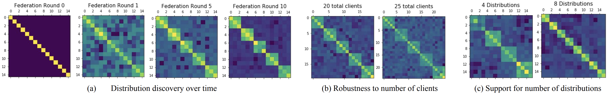

[](https://github.com/mzio/federated-fomo/blob/opensource/LICENSE)


# Personalized Federated Learning with First Order Model Optimization

<!--  -->
<div align="center">
  
</div>
<p align="left">
FedFomo client-to-client weights over time (lighter -> higher weight). FedFomo discovers clients with the same underlying data distribution, assigning higher weights between clients with the same local data distributions (neighboring rows), <i>without</i> directly exposing local data to the server or other clients.
</p>

### [Paper](https://arxiv.org/abs/2012.08565)  

Personalized Federated Learning with First Order Model Optimization  
Michael Zhang, Karan Sapra, Sanja Fidler, Serena Yeung, Jose M. Alvarez  
ICLR 2021 

This repository contains training & evaluation code for Federated First Order Model Optimization (FedFOMO), our personalized federated learning algorithm introduced in [Personalized Federated Learning with First Order Model Optimization](https://arxiv.org/abs/2012.08565).


## Setup

### Requirements  

We include a `requirements.txt` file for installing dependencies with `pip install -r requirements.txt`. List of installable dependencies:  
* pytorch  
* torchvision  
* numpy  
* tqdm  
* scikit-learn  
* pandas  
* matplotlib

### Additional directories
Before running the below commands, please create the following directories with `mkdir data logs models precomputed results`.


## Training and evaluation
We include code to run experiments on CIFAR-10 and CIFAR-100 as in the paper. Please see the following commands below. Details for each argument are included in `./federated/args.py`. 

For FedFomo (5 and 10 models)
```
# 5 models
python main.py --dataset cifar10 --max_epoch 20 --federation_epoch 5 --federation_method fomo --num_update_clients 4 --num_distributions 5 --num_clients 15 --client_weight_method e_greedy --client_weight_epsilon 0.3 --client_weight_epsilon_decay 0.05 --leave_one_out --model_weight_delta 1 -r 0 --momentum 0.0 --bs_trn 50 --bs_val 50 --lr 0.1 --learning_rate_decay 0.99 --optimizer sgd -elfs 0 --seed 0 --data_seed 0 -nlvp 0. -lvr 1. --baseline_model first_model --arch tf_cnn --softmax_client_weights --train_split 0.8 -fr 1.0 -nf 5 --device 0

# 10 models
python main.py --dataset cifar10 --max_epoch 20 --federation_epoch 5 --federation_method fomo --num_update_clients 9 --num_distributions 5 --num_clients 15 --client_weight_method e_greedy --client_weight_epsilon 0.3 --client_weight_epsilon_decay 0.05 --leave_one_out --model_weight_delta 1 -r 0 --momentum 0.0 --bs_trn 50 --bs_val 50 --lr 0.1 --learning_rate_decay 0.99 --optimizer sgd -elfs 0 --seed 0 --data_seed 0 -nlvp 0. -lvr 1. --baseline_model first_model --arch tf_cnn --softmax_client_weights --train_split 0.8 -fr 1.0 -nf 5 --device 0
```

For FedAvg:
```
python main.py --dataset cifar10 --max_epoch 20 --federation_epoch 5 --federation_method fedavg --federated_averaging --num_update_clients 4 --num_distributions 5 --num_clients 15 --client_weight_method e_greedy  --client_weight_epsilon 0.3 --client_weight_epsilon_decay 0.05 --leave_one_out --model_weight_delta 1 -r 0 --momentum 0.0 --bs_trn 50 --bs_val 50 --lr 0.1 --learning_rate_decay 0.99 --optimizer sgd -elfs 0 --seed 0 --data_seed 0 -nlvp 0. -lvr 1. --baseline_model first_model --arch tf_cnn --softmax_client_weights --train_split 0.8 -fr 1.0 -nf 5 --device 0
```

For Local training:
```
python main.py --dataset cifar10 --max_epoch 20 --federation_epoch 5 --federation_method local --num_update_clients 4 --num_distributions 5 --num_clients 15 --client_weight_method e_greedy --client_weight_epsilon 0.3 --client_weight_epsilon_decay 0.05 --leave_one_out --model_weight_delta 1 -r 0 --momentum 0.0 --bs_trn 50 --bs_val 50 --lr 0.1 --learning_rate_decay 0.99 --optimizer sgd -elfs 0 --seed 0 --data_seed 0 -nlvp 0. -lvr 1. --baseline_model first_model --arch tf_cnn --softmax_client_weights --train_split 0.8 -fr 1.0 -nf 5 --device 0
```


## Citation  
```
@article{zhang2020personalized,
  title={Personalized federated learning with first order model optimization},
  author={Zhang, Michael and Sapra, Karan and Fidler, Sanja and Yeung, Serena and Alvarez, Jose M},
  journal={arXiv preprint arXiv:2012.08565},
  year={2020}
}
```


